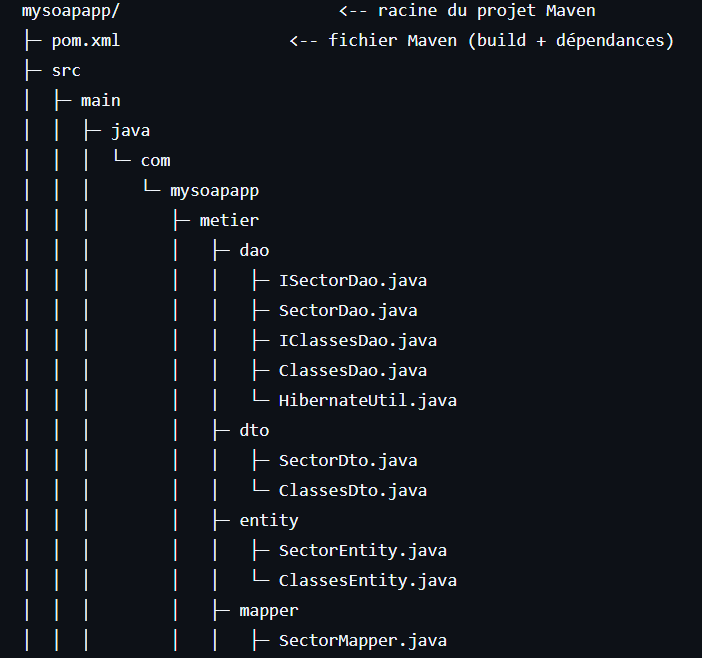
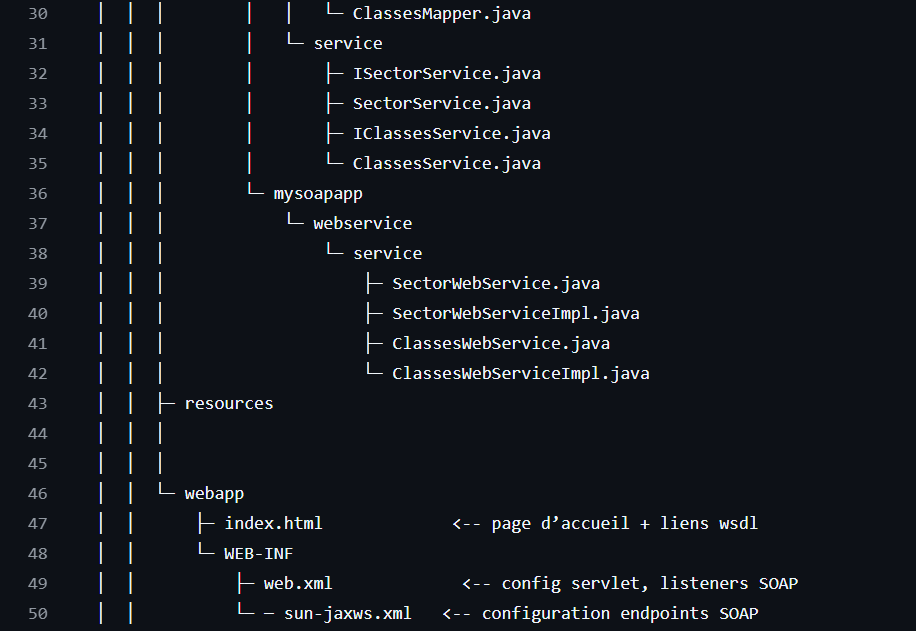
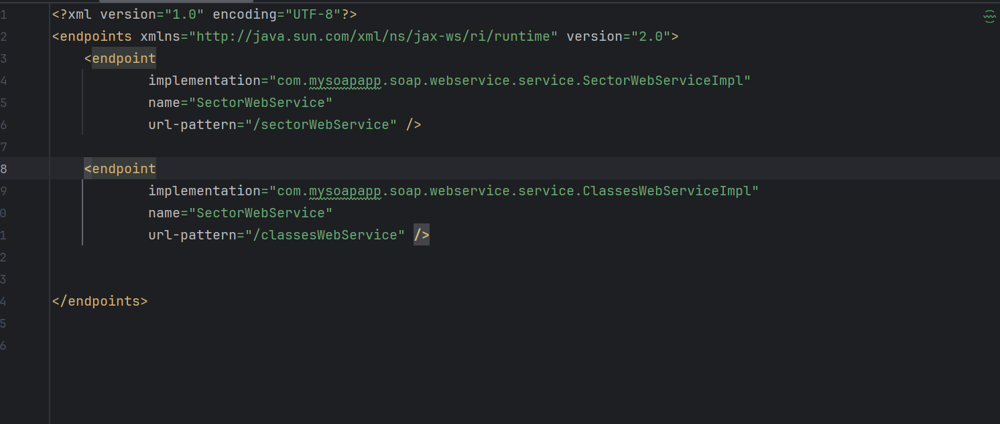
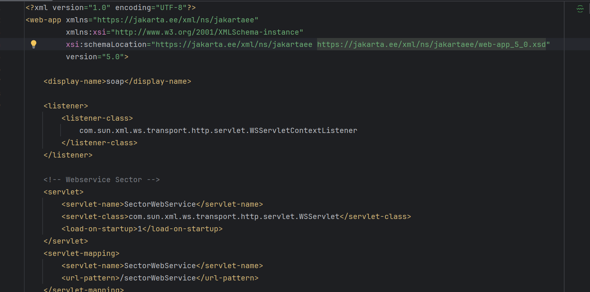
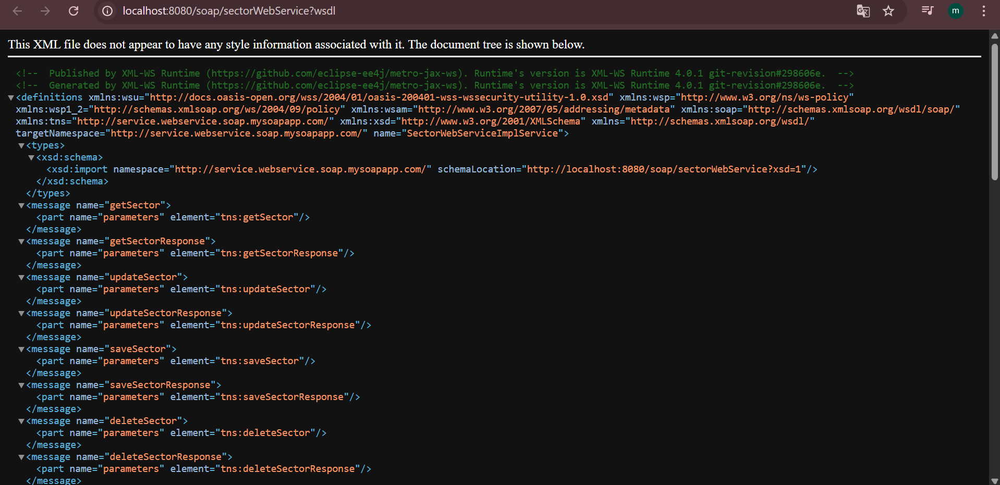
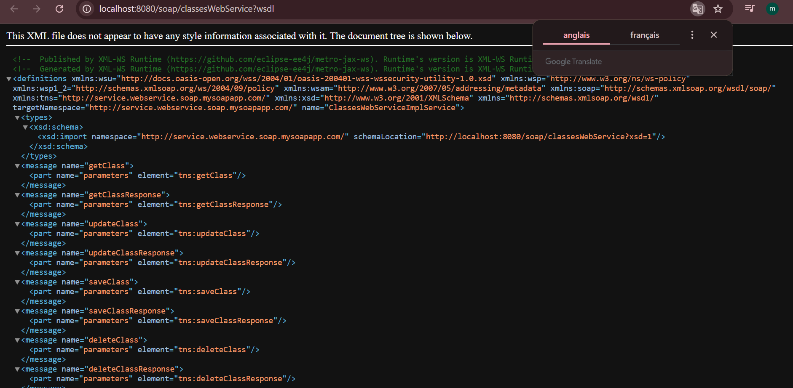
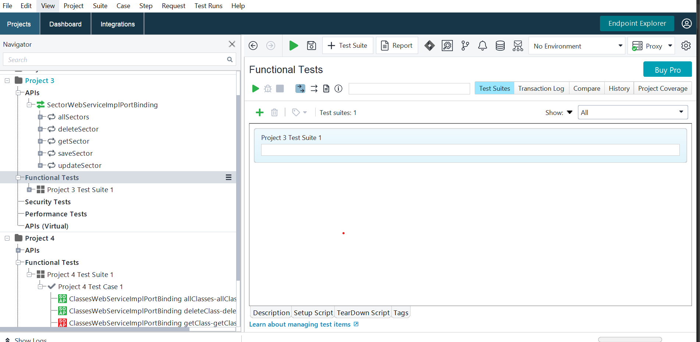
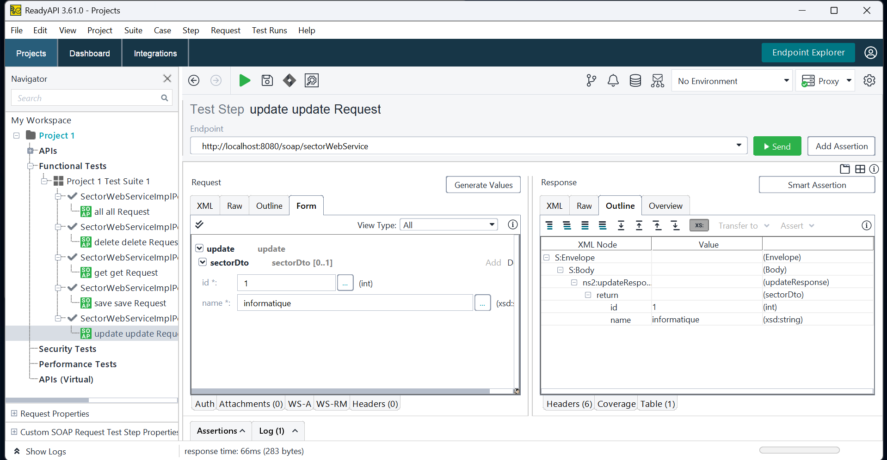
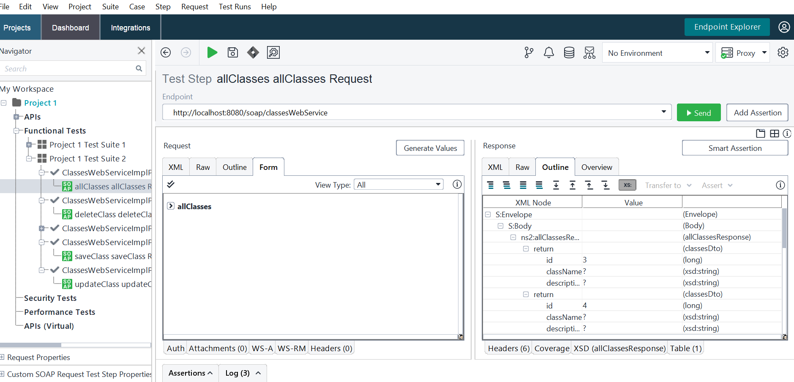
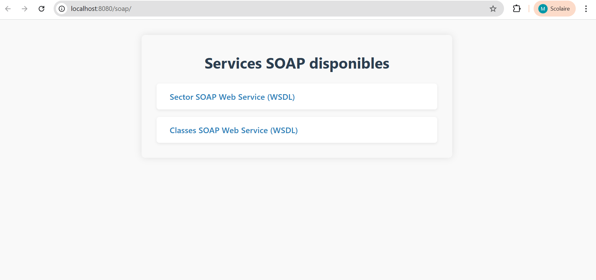

# **SOAP Web Service Project**

## 1. Présentation
Ce projet est une application Java EE fournissant des Web Services SOAP pour gérer des entités Sector et Classes.
Le backend utilise Hibernate pour la persistance, et JAX-WS pour exposer les services.

### Architecture de notre projet:




## 2.Objectifs
* Implémenter un CRUD complet via SOAP pour deux entités métier : Sector et Classes
* Mettre en place une architecture claire (DAO, Service, DTO, WebService)
* Utiliser Hibernate pour la gestion base de données
* Configurer les endpoints SOAP via sun-jaxws.xml et web.xml
* Permettre un accès simple aux WSDLs via navigateur

## 3.1 Couches principales
* Entity : objets mappés Hibernate (ex. SectorEntity)
* DTO : objets de transfert (ex. SectorDto)
* DAO : accès DB via Hibernate (ex. SectorDao)
* Service : logique métier (ex. SectorService)
* WebService : interface SOAP exposée (ex. SectorWebServiceImpl)

## 3.2 Configuration
Fichier sun-jaxws.xml pour définir les endpoints SOAP:

web.xml configure le servlet JAX-WS et le listener :


## 4.Fonctionnement
* Les Web Services exposent les opérations CRUD sur les entités métier via des méthodes annotées JAX-WS.
* Les clients peuvent accéder aux WSDL via des URL exposées par le serveur (ex : /sectorWebService?wsdl).
* Le sun-jaxws.xml déclare plusieurs endpoints, chacun lié à une classe d’implémentation.
* Le servlet WSServlet dans web.xml route les requêtes SOAP vers les services déclarés.




## 5.Etapes de création
1. Définition des entités avec Hibernate (SectorEntity, ClassesEntity, etc.).
2. Création des DTO correspondants (SectorDto, etc.).
3. Implémentation des DAO pour les opérations base de données.
4. Création des services métier qui utilisent les DAO et les mappers.
5. Développement des interfaces WebService JAX-WS et leurs implémentations.
6. Configuration des endpoints SOAP dans sun-jaxws.xml.
7. Configuration du déploiement via web.xml (listener + servlet JAX-WS).
8. Tests et vérification des WSDLs accessibles via navigateur.

## 6. Fichiers clés
* sun-jaxws.xml : déclare tous les endpoints SOAP avec leurs URL patterns.
* web.xml : configure le listener et le servlet JAX-WS.
* database.properties : configuration base de données.
* HibernateUtil.java : configuration Hibernate et gestion de SessionFactory.
On va juste prendre l'exemple d'une classe
* SectorWebServiceImpl.java : implémentation des services SOAP.
* SectorService.java : service métier.
* SectorDao.java : DAO Hibernate.

## 8.Tests


## 7.Conclusion
Cette architecture permet une évolution simple avec ajout progressif de nouveaux services SOAP.
L’usage de Hibernate garantit la gestion fiable de la persistance.
La configuration via sun-jaxws.xml facilite la gestion centralisée des endpoints SOAP.

#### Accéder à l’interface sur :
   ```
   http://localhost:8080/soap/
  
   ```
